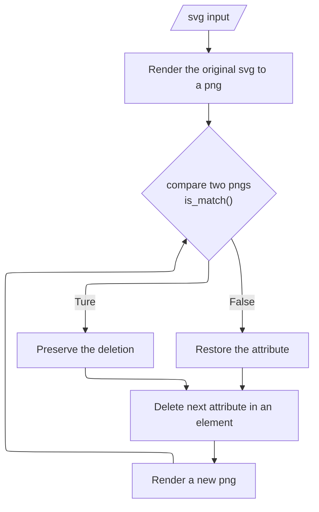

# render2compressvg

## About

**render2compressvg** optimizes SVGs for size while preserving visual fidelity. It works by generating PNGs based on the original SVG and iteratively removing attributes from each element. If the rendered PNG matches the original, the attribute deletion is kept, otherwise the attribute is restored. This method ensures lossless compression while potentially removing unnecessary information.





[toc]

## Usage & Examples


It's recommended to call other svg optimizers such as [svgo](https://github.com/svg/svgo) first, for render2compressvg is *very* slow (takes ~10 seconds to handle a ~16kB svg). Implementing pre-compression significantly accelerates the speed.


For instance svgo -> render2compressvg -> svgo:

```shell
input.svg:
Done in 134 ms!
145.604 KiB - 88.2% = 17.154 KiB

render2compressvg 
17.154 KiB -> 12.626 KiB

output.svg:
Done in 45 ms!
12.626 KiB - 12.7% = 11.019 KiB
```


## Limitations

1. It is **SLOW**, but an option for extreme compression, I guess.
2. Some `.dll` s are missing on Windows
3. MacOS and Linux are not tested


## Todo

- [ ] loop for `element` first
- [ ] svg2png: ~~Inkscape (golden standard, but x20 slower)~~ + cairosvg (default) / resvg (not fully tested to reach the ideal speed)
  - ==current bottleneck== (100ms+): even faster?
  - svg standard support: [SVG 1.1 Full Static Support (razrfalcon.github.io)](https://razrfalcon.github.io/resvg-test-suite/svg-support-table.html)
    - fonts, especially
- [x] faster png comparison methods: Binary intersection of union (40ms for a typical png) ~~, NRMSE (x6 slower, but better comparison algorithm), SSIM (x60 slower, golden comparison method for png with high frequency information)~~
  - [ ] even faster?
  - tradeoff: effective (shape, color and placement...) 
- [ ] Look into `async`, multi-thread support: faster?
- [ ] polish README

## Considerations

### svg2raster

Some columns and rows are currently disorganized and unclear.

|                       | **Drawing** backend library                                  | DPI support for some svgs (blurry)          | DPI 1px output | `font-family="Times"`                 | (Bold) `font-family:ProximaNova` locally installed | Other unsupported features on default | Language | Speed | Time in ms  |
| --------------------- | ------------------------------------------------------------ | ------------------------------------------- | -------------- | ------------------------------------- | -------------------------------------------------- | ------------------------------------- | -------- | ----- | ----------- |
| Inkscape              | [Cairo](https://wiki.inkscape.org/wiki/Tracking_Dependencies) | ✔️                                           | 1px            | ✔️                                     | ✔️                                                  |                                       |          | 🐢🦥    | 1990+2364   |
| playwright (Chromium) | ?Skia+?Blink                                                 | ✔️                                           |                | ✔️                                     | ❌ ?YaHei                                           | unicode(mos)                          |          | 🐢     | 1046 / 1023 |
| playwright (Firefox)  | ?Skia+?Gecko                                                 | ✔️                                           |                | ✔️                                     | ❌ ?YaHei                                           | unicode(mos)                          |          | 🐢🦥    |             |
| resvg                 | resvg                                                        | ✔️ ^1^ use `--zoom dpi/96`                   |                | ❓                                     | ❌ Times                                            |                                       | Rust     | 🐆🦘    | 130 + 607   |
| cairosvg (pip)        | ?cairo                                                       | ✔️ ^1^ use `scale=dpi/96`                    |                | ❌                                     | ❌ Arial                                            |                                       |          | 🐆     | 91 + 2018   |
| rsvg-convert          | rsvg                                                         | ✔️ ^1^ use `--zoom=dpi/96`                   |                | ❌                                     | ❌                                                  | place(mos)                            |          |       | 176 + 2968  |
| ImageMagick           | https://github.com/ImageMagick/rsvg librsvg?                 | ✔️                                           |                | ❌                                     | ❌                                                  | place(mos)                            |          | 🐆     | 278+661     |
| wand                  | librsvg                                                      | ✔️                                           |                | ❌                                     | ❌                                                  | place(mos)                            |          | 🐆     | 158+658     |
| pyvips                | libvips-->librsvg--?-->cairo                                 | ✔️ ^2^ different value                       | 1px            | ❌                                     | ❌                                                  | place(mos)                            |          | 🐆     | 223+280     |
| pymupdf               |                                                              | ✔️ ^2^ different value                       |                | ❌ Always fall back to Times New Roman | ❌ Times New Roman                                  | dash(one) style(mos)                  |          | 🐆     | 92 + 177    |
| svglib+reportlab      |                                                              | ❓                                           |                | ❓                                     |                                                    | embedded image(one)                   |          | 🐢🦥    | 2867        |
| skia-python           |                                                              | todo                                        |                | todo                                  |                                                    |                                       |          |       |             |
| pyppeteer (Chromium)  | ?Skia+?Blink                                                 | Waiting for stable release of pyppeteer 2.0 |                |                                       |                                                    |                                       |          |       |             |
| svgpp (NA for python) |                                                              |                                             |                |                                       |                                                    |                                       | c++      |       |             |

^1^ : Changing DPI to improve clarity of raster images only works on `<svg xmlns="http://www.w3.org/2000/svg" width="10mm" height="20mm" viewBox="0 0 30 40">`, not works on  `<svg xmlns="http://www.w3.org/2000/svg" width="10" height="20" viewBox="0 0 30 40">`

 ^2^ : `<svg xmlns="http://www.w3.org/2000/svg" width="1" height="2" viewBox="0 0 3 4">` got different pixel numbers on the output png.

> Other facts:
>
> `librsvg` parses SVG files and uses `cairo` to render the graphics.

### rendered images comparison metheds

todo
