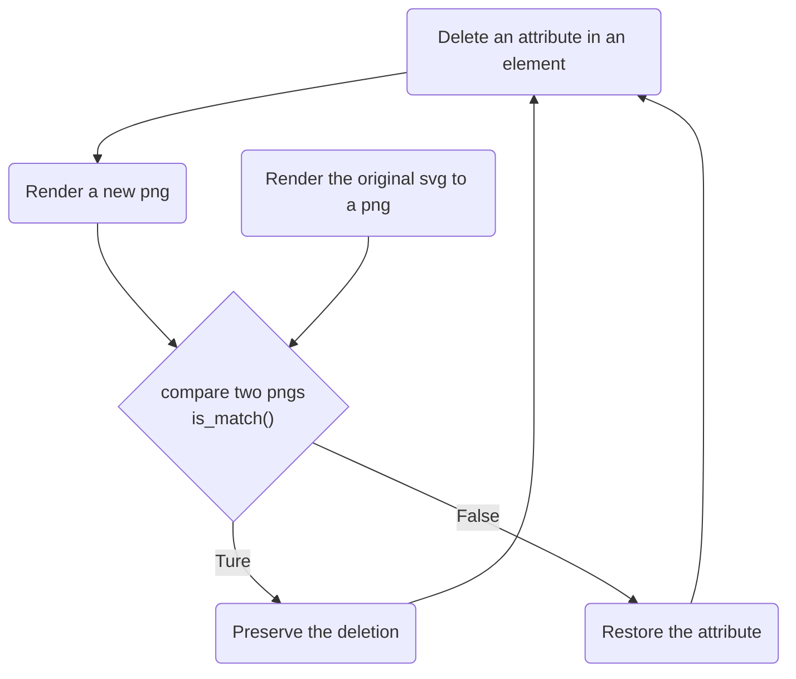

# render2compressvg

## About

**render2compressvg** optimizes SVGs for size while preserving visual fidelity. It works by generating PNGs based on the original SVG and iteratively removing attributes from each element. If the rendered PNG matches the original, the attribute deletion is kept, otherwise the attribute is restored. This method ensures lossless compression while potentially removing unnecessary information.

[toc]

## Usage & Examples

todo

## Todo & Roadmap

tood

